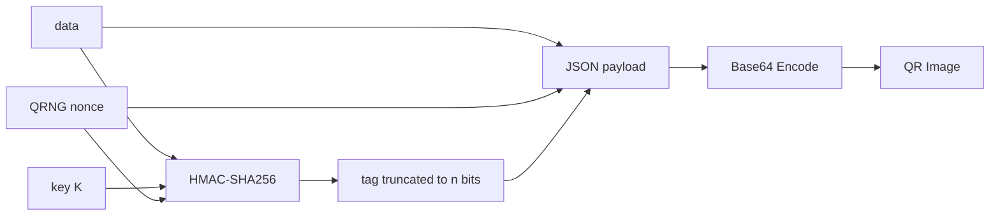

# Quantum Tamper-Evident QR Codes — Design Document

# Threat Model

This section defines the attacker capabilities, verifier assumptions, and security boundaries for the project.

The goal is to clearly specify:

* what attacks the system attempts to detect
* what assumptions the design relies on
* what is intentionally out of scope

---

# System Overview

The system generates QR codes containing:

* payload data
* a quantum-generated nonce
* a verification tag derived from a shared secret

A verifier:

1. Reads the QR payload
2. Recomputes the expected verification behavior
3. Uses a Deutsch–Jozsa / Bernstein–Vazirani style oracle check
4. Detects whether the QR was modified

The design assumes a hybrid classical-quantum verification pipeline.

---

# Attacker Capabilities

The attacker is assumed to have full access to the QR image itself and may attempt several types of tampering.

## 1. Full QR Replacement

The attacker may:

* replace the entire QR code
* generate a completely different QR image
* attempt to impersonate a legitimate issuer

Example:

* replacing a payment QR with one pointing to the attacker's account

---

## 2. Payload Modification

The attacker may modify:

* recipient IDs
* URLs
* transaction values
* embedded metadata

while attempting to keep the QR otherwise valid.

---

## 3. Nonce Modification

The attacker may alter:

* the quantum-generated nonce
* replay identifiers
* randomness fields

in an attempt to bypass integrity checks.

---

## 4. Verification Tag Modification

The attacker may:

* alter the stored verification tag
* forge a new tag
* attempt random guessing attacks

However, the attacker is assumed NOT to know the shared secret key used to generate valid tags.

---

## 5. Replay Attacks

The attacker may:

* copy an old valid QR code
* reuse previously captured QR payloads
* present expired or previously accepted codes

Replay prevention mechanisms may later include:

* timestamps
* expiration windows
* nonce tracking

but full replay protection is not fully implemented in the current prototype.

---

# Verifier Assumptions

The verifier is assumed to possess:

* the QR image or decoded payload
* the verification algorithm
* a pre-shared secret key `K`

The verifier recomputes the expected verification behavior using the shared key.

If the recomputed behavior does not match the observed QR payload, the QR is considered tampered.

---

# Keyed Integrity Model

This project uses a keyed integrity model.

Issuer and verifier share a secret key:

```text
K
```

The key is used to derive:

* verification tags
* hidden oracle secrets
* expected Deutsch–Jozsa / Bernstein–Vazirani outputs

This assumption is critical.

Without a secret key:

* anyone could generate a new valid tag
* attackers could recompute integrity values after tampering
* the system would provide no meaningful authenticity guarantees

Therefore, security depends on the attacker NOT knowing the shared key.

---

# Out of Scope

The following threats are explicitly NOT addressed in this project.

## 1. Key Distribution

Secure distribution and storage of the shared key `K` is out of scope.

The project assumes:

* issuer and verifier already possess the same trusted secret key.

---

## 2. Denial of Service

The system does not attempt to prevent:

* QR destruction
* scanner flooding
* malformed-image attacks
* resource exhaustion attacks

---

## 3. Side-Channel Attacks

The project does not defend against:

* timing attacks
* power analysis
* memory inspection
* hardware leakage

---

## 4. Quantum Cryptanalysis

The project does not attempt to resist:

* large-scale fault-tolerant quantum attackers
* Shor-based attacks on classical cryptography
* future cryptanalytic breakthroughs

The focus is on:

* learning quantum algorithms
* hybrid classical-quantum verification design
* tamper detection experiments

not production-grade post-quantum cryptography.

---

## 5. Physical Device Compromise

If the issuer or verifier device itself is compromised:

* malware
* stolen keys
* memory extraction

the system security fails.

Endpoint security is out of scope.

---

# Security Goal

The primary security goal is:

> Detect unauthorized modification of QR payload data by attackers who do not possess the shared secret key.

The system is intended to provide:

* tamper evidence
* payload integrity verification
* experimental quantum-assisted verification behavior

rather than full cryptographic authentication guarantees.

# Payload Schema Design

This section defines the exact structure stored inside the QR code and explains the reasoning behind each design decision.

The payload must:

* be compact enough for QR encoding
* support integrity verification
* bind the data to a secret key
* integrate with the Deutsch–Jozsa / Bernstein–Vazirani oracle design

---

# Proposed Payload Format

The QR payload is represented as JSON:

```json
{
  "version": "1",
  "data": "the actual message",
  "nonce": "<hex string from QRNG>",
  "tag": "<truncated HMAC-SHA256 output>"
}
```

The JSON string is then base64-encoded before being converted into a QR image.

---

# Field Definitions

| Field     | Type       | Size                    | Purpose                                       |
| --------- | ---------- | ----------------------- | --------------------------------------------- |
| `version` | string     | 1 char                  | Schema versioning                             |
| `data`    | string     | variable                | Actual payload message                        |
| `nonce`   | hex string | 32 hex chars (128 bits) | Quantum-random binding value                  |
| `tag`     | hex string | 2 hex chars (`n=8`)     | Truncated HMAC tag → becomes DJ oracle secret |

---

# Example Payload

```json
{
  "version": "1",
  "data": "pay:alice:50",
  "nonce": "9f2a3b1c4d5e6f778899aabbccddeeff",
  "tag": "a7"
}
```

After JSON serialization:

```text id="f1djlwm"
{"version":"1","data":"pay:alice:50","nonce":"...","tag":"a7"}
```

the payload is base64-encoded and embedded into the QR code.

---

# Why Use HMAC Instead of Plain SHA-256?

The system uses:

```text id="r4x0ja"
HMAC-SHA256(K, data || nonce)
```

rather than a plain hash.

This is critical.

A plain SHA-256 hash is public and keyless:

* an attacker could modify the payload
* recompute the hash
* generate a new valid QR code

The system would detect nothing.

HMAC introduces a secret key:

```text id="v2n58w"
K
```

known only to:

* the issuer
* the verifier

This binds the integrity tag to a secret the attacker does not possess.

Without the key, attackers cannot generate valid tags for modified payloads.

---

# Why Include a Nonce?

The nonce serves several purposes:

* prevents deterministic tag reuse
* binds each QR to unique randomness
* reduces replay predictability
* demonstrates integration of quantum randomness into the system

The nonce is generated using the project's quantum random number generator (QRNG).

Current design:

* 128-bit nonce
* represented as 32 hexadecimal characters

Example:

```text id="rq6x5j"
9f2a3b1c4d5e6f778899aabbccddeeff
```

---

# Why Include a Version Field?

The version field allows the schema to evolve without breaking compatibility.

Future versions may:

* change hash algorithms
* change oracle widths
* add timestamps
* add signatures
* add replay-protection metadata

Without versioning, older verifiers could misinterpret newer QR formats.

Versioning is inexpensive and improves long-term maintainability.

---

# Oracle Width Selection

The verification tag is truncated to:

```text id="xq94aq"
n = 8 bits
```

before conversion into the Deutsch–Jozsa / Bernstein–Vazirani oracle secret.

This means:

* 8 input qubits
* 1 ancilla qubit
* total = 9 qubits

This design was chosen because:

* free IBM Quantum hardware supports it comfortably
* shallow circuits reduce decoherence risk
* fewer qubits improve simulator and hardware reliability
* execution latency remains low

---

# Trade-Off: 8 Bits vs 16 Bits

## n = 8

Advantages:

* only 9 total qubits
* shallow circuits
* high hardware compatibility
* lower noise sensitivity

Disadvantages:

* smaller tag space
* weaker brute-force resistance

---

## n = 16

Advantages:

* stronger integrity space
* harder random guessing attacks

Disadvantages:

* requires 17 qubits
* deeper circuits
* higher hardware noise
* reduced reliability on current public quantum devices

For this educational prototype, `n = 8` is the preferred trade-off.

---

# Why JSON + Base64?

The payload is encoded as:

```text id="8yxfki"
JSON → Base64 → QR Image
```

## JSON

JSON was chosen because:

* human-readable
* easy to debug
* language-independent
* easy to extend

---

## Base64

Base64 ensures:

* ASCII-safe encoding
* no special-character issues
* compatibility across QR libraries and scanners

This avoids edge cases involving:

* quotes
* binary bytes
* Unicode handling
* escaping problems

---

# QR Capacity Considerations

Typical QR codes can store approximately:

```text id="6q7x0n"
~2,500 alphanumeric characters
```

depending on:

* QR version
* error correction level

The proposed payload is far smaller than this limit, so QR storage capacity is not a constraint for the project.

---

# Verification Flow

Generator:

```text id="7t6d8n"
data + nonce + key K
        ↓
HMAC-SHA256
        ↓
truncate to n bits
        ↓
oracle secret
        ↓
embed in QR
```

Verifier:

```text id="wrb9uc"
read QR
    ↓
extract fields
    ↓
recompute HMAC using K
    ↓
derive expected oracle secret
    ↓
run DJ/BV circuit
    ↓
compare measurement
```

If the measured secret differs from the expected secret, the QR is considered tampered.


# Generate and Verify Flows

This section describes the complete end-to-end workflow for both QR generation and QR verification.

The system combines:

* classical cryptographic integrity protection
* quantum-generated randomness
* Deutsch–Jozsa / Bernstein–Vazirani oracle verification

The key idea is:

* authentic QR → observed tag matches expected tag
* tampered QR → observed tag differs from expected tag

The XOR difference between tags becomes the hidden oracle secret.

---

# QR Generation Flow

The issuer creates a QR payload using:

* payload data
* a shared secret key `K`
* a quantum-generated nonce

---

# Step-by-Step Generation Process

1. Start with:

   * payload data
   * shared secret key `K`

2. Generate a 128-bit quantum nonce using the QRNG module.

3. Compute:

```text id="rw9i4k"
HMAC-SHA256(K, data || nonce)
```

4. Truncate the HMAC output to `n` bits.

Current design:

* `n = 8`

5. Convert the truncated value into the verification tag.

6. Build the JSON payload:

```json
{
  "version": "1",
  "data": "...",
  "nonce": "...",
  "tag": "..."
}
```

7. Base64-encode the JSON string.

8. Generate the QR image from the base64 payload.

---

# Generation Flow Diagram



---

# QR Verification Flow

The verifier:

* scans the QR
* recomputes the expected tag
* converts the difference into a quantum oracle secret
* runs the Deutsch–Jozsa / Bernstein–Vazirani circuit

The quantum circuit determines whether:

* the tags match
* or the payload has been modified

---

# Step-by-Step Verification Process

1. Read the QR image.

2. Decode using OpenCV:

```text id="znvjlwm"
cv2.QRCodeDetector()
```

3. Base64-decode the payload.

4. Parse the JSON fields:

```text id="6vl6j5"
{version, data, nonce, tag_observed}
```

5. Recompute:

```text id="0i9m2x"
tag_expected = HMAC-SHA256(K, data || nonce)
```

6. Truncate the recomputed tag to `n` bits.

7. Compute the XOR difference:

s = tag_{observed} \oplus tag_{expected}

This produces the hidden oracle secret:

```text id="evjlwm"
s
```

---

# Interpretation of s

## Authentic QR

If:

tag_{observed} = tag_{expected}

then:

s = 0\ldots0

The oracle becomes constant.

Deutsch–Jozsa measures:

```text id="omfgq5"
000...0
```

meaning:

* authentic
* no tampering detected

---

## Tampered QR

If:

tag_{observed} \neq tag_{expected}

then:

s \neq 0\ldots0

The oracle becomes balanced.

Deutsch–Jozsa / Bernstein–Vazirani measures:

```text id="rkbrlm"
s
```

which directly reveals:

* which bits differ
* how the observed tag differs from the expected tag

This means the quantum measurement is performing real informational work rather than acting as a decorative quantum wrapper.

---

# Verification Flow Diagram

```mermaid
flowchart LR

  QR[QR Image]
    --> D[OpenCV Decode]

  D --> B[Base64 Decode]

  B --> J[JSON Parse]

  J --> O[tag_observed]

  J --> DATA[data]
  J --> NONCE[nonce]

  DATA --> H[HMAC-SHA256]
  NONCE --> H
  K[key K] --> H

  H --> E[tag_expected]

  O --> X[XOR]
  E --> X

  X --> S[secret s]

  S --> ORACLE[oracle_from_secret(s)]

  ORACLE --> DJ[Deutsch-Jozsa / BV Circuit]

  DJ --> RESULT[Measurement]

  RESULT --> AUTH[000...0 = Authentic]
  RESULT --> TAMPER[non-zero = Tampered]
```

---

# Why XOR?

The XOR step is the key bridge between:

* classical cryptography
* quantum oracle construction

The XOR result:

s = tag_{observed} \oplus tag_{expected}

acts as the hidden oracle secret.

This elegantly maps integrity verification into a quantum oracle problem.

---

# Important Observation

This design effectively transforms:

```text id="d8jclm"
Integrity Verification
```

into:

```text id="m6i1wz"
Hidden Secret Recovery
```

which is exactly the type of problem solved by the Bernstein–Vazirani algorithm.

The project therefore combines:

* QR systems
* HMAC-based integrity
* quantum randomness
* hidden-string quantum algorithms

into one unified verification pipeline.


## 5. Limitations & Security Considerations

A critical component of this system's design is acknowledging its practical and theoretical boundaries. This implementation is an educational demonstration of quantum verification mechanics and is subject to the following limitations:

* **Pre-Shared Key Requirement:** This system operates strictly on a symmetric, keyed-integrity model. Anyone possessing the secret key `K` can forge valid QR codes. Secure key distribution and rotation between the issuer and verifier are explicitly out of scope for this project.
* **Equivalence to Classical HMAC:** From a pure security standpoint, a classical verifier checking `tag_observed == tag_expected` accomplishes the exact same integrity guarantee with significantly less computational complexity. The use of the Deutsch-Jozsa algorithm here serves as a proof-of-concept for quantum verification mechanics, rather than providing a cryptographic security upgrade over standard classical methods.
* **Quantum Hardware Noise (NISQ Era):** Physical quantum computers are subject to decoherence and gate errors. When running on real backends rather than ideal simulators, the Deutsch-Jozsa circuit may occasionally yield small probabilities for incorrect bitstrings even for valid (constant) oracles. The verifier implementation must account for this by using a confidence threshold (e.g., executing `shots=1024` and accepting the most frequent outcome).
* **Truncated State Space (`n=8`):** To accommodate current quantum simulator capabilities and keep the circuit depth manageable, the oracle size is limited to an 8-bit space. This means an attacker capable of guessing and resubmitting forged payloads has a successful forgery probability of 1/256. A production-ready deployment would require a vastly larger `n` or rely entirely on the full cryptographic strength of the underlying HMAC rather than a truncated representation.
* **Not a Post-Quantum Cryptography (PQC) Implementation:** While HMAC-SHA256 is currently considered robust against attacks from quantum computers running Shor's algorithm, this project does not analyze or claim post-quantum security guarantees. The mixing function is used exclusively for its keyed-integrity properties to format the quantum state, nothing more.