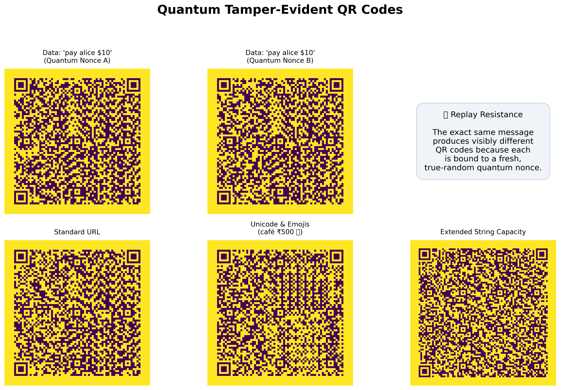

# Quantum Tamper-Evident QR Codes

A QR code system that uses true quantum randomness for nonce generation and the Deutsch-Jozsa algorithm for single-query tamper verification. Built with Qiskit.

> **Status:** In development — Day 11 of 21 complete. The generator phase is finished: a robust, documented, command-line tool producing QRs backed by a quantum-random nonce and HMAC tag, validated against a labeled fixture corpus. Next: the quantum verifier.



## Motivation

Standard QR codes are vulnerable to physical swap attacks (common in payment fraud) and digital tampering. This project explores whether quantum primitives can strengthen QR integrity:

- **True randomness** — Nonces come from quantum measurements (Hadamard + measure), not pseudo-random functions, so they cannot be reproduced from a seed.
- **Single-query verification** — A Deutsch-Jozsa oracle lets a verifier detect tampering in one quantum query: untampered → constant oracle → measures all zeros; tampered → balanced oracle → measures non-zero.

This is primarily a learning and engineering exploration. A classical HMAC achieves tamper detection with less complexity; the value here is in implementing real quantum algorithms end-to-end and running them on actual quantum hardware.

## Design

The full payload schema, threat model, generate/verify flows, and limitations are documented in [`DESIGN.md`](DESIGN.md). In short:

- QR payload is a base64-encoded JSON object: `{version, data, nonce, tag}`
- `nonce` is 128 bits from the quantum RNG
- `tag` is an HMAC-SHA256(K, data || nonce) truncated to **n = 8 bits**
- Verification: recompute the expected tag, XOR with the observed tag to get a secret `s`, build `oracle_from_secret(s)`, run DJ
- Authentic QR → s = 0 → constant oracle → DJ measures zeros
- Tampered QR → s ≠ 0 → balanced oracle → DJ measures the differing bits

## What's working today

**Generator** (`quantum_qr/generator.py`)
- `generate(data, output_path, n_bits=8, key=None, nonce=None)` — one call produces a tamper-evident QR and returns its payload metadata
- Wires together QRNG → HMAC tag → payload → QR image
- Fail-fast input validation, QR capacity guard, full UTF-8 support
- Fresh quantum nonce per call; optional `nonce` injection for reproducible tests/fixtures

**Command-Line Interface** (`quantum_qr/cli.py`, `quantum_qr/__main__.py`)
- `python -m quantum_qr generate "<data>" -o out.png [-n 8] [--json]`
- Friendly errors and proper exit codes (0 success / 1 application error / 2 usage)
- Subcommand structure ready for the `verify` command in the next phase

**Test Fixtures** (`quantum_qr/fixtures.py`)
- Builds a labeled corpus of authentic + tampered QRs (data/nonce/tag tampering, wrong-key forgery, corruption)
- Writes a `manifest.json` ground-truth answer key (expected verdict + expected secret per fixture)
- Handles the 2^(−n_bits) collision rate explicitly

**Payload Layer** (`quantum_qr/payload.py`, `quantum_qr/config.py`)
- `compute_tag` (HMAC-SHA256 → n bits), `build/encode/decode_payload`, `tags_to_secret` (XOR bridge to DJ)
- `get_key()` via `QTQR_KEY` env var with a documented demo fallback

**Deutsch-Jozsa Circuit** (`quantum_qr/dj.py`)
- `build_dj_circuit`, `constant_oracle_zero/one`, `balanced_oracle`, `oracle_from_secret(s)`
- `oracle_from_secret` unifies constant/balanced and recovers s in one query (Bernstein-Vazirani behavior)

**Quantum RNG** (`quantum_qr/qrng.py`)
- 128-qubit Hadamard circuit; binary/hex nonces; chi-square validated (p = 0.XX)  ← *replace with your value*

**Classical QR I/O** (`quantum_qr/qr_io.py`)
- `make_qr` / `read_qr` — lossless encode/decode via `qrcode` and OpenCV

## Project structure

```
quantum-tamper-evident-qr/
├── quantum_qr/
│   ├── __init__.py                   # Public API + package docstring
│   ├── qrng.py                       # Quantum random number generator
│   ├── dj.py                         # Deutsch-Jozsa circuit + oracles
│   ├── qr_io.py                      # Classical QR encode/decode
│   ├── payload.py                    # HMAC tag, payload encode/decode, tags-to-secret
│   ├── config.py                     # Shared-key handling
│   ├── generator.py                  # End-to-end generate()
│   ├── fixtures.py                   # Authentic + tampered fixture builder
│   ├── cli.py                        # argparse CLI (generate; verify reserved)
│   └── __main__.py                   # enables `python -m quantum_qr`
├── notebooks/
│   ├── day1_qrng.ipynb
│   ├── day2_qrng_scaling.ipynb
│   ├── day3_dj_constant.ipynb
│   ├── day4_dj_balanced_and_qr.ipynb
│   ├── day6_payload.ipynb
│   ├── day7_generator.ipynb
│   ├── day8_generator_robustness.ipynb
│   ├── day9_fixtures.ipynb
│   ├── day10_cli.ipynb
│   └── day11_gallery.ipynb
├── tests/
│   ├── test_qrng.py
│   ├── test_dj.py
│   ├── test_qr_io.py
│   ├── test_payload.py
│   ├── test_generator.py
│   ├── test_fixtures.py
│   └── test_cli.py
├── data/
│   ├── sample_nonce.txt
│   ├── design_sketch.jpg
│   ├── gallery.png
│   ├── alice_payment.png
│   └── fixtures/                     # generated QR corpus + manifest.json
├── DESIGN.md                         # Threat model, schema, flows, limitations
├── LEARNINGS.md                      # Daily learning log
├── requirements.txt
└── README.md
```

## Installation

Requires Python 3.10 or newer.

```bash
git clone https://github.com/YOUR_USERNAME/quantum-tamper-evident-qr.git
cd quantum-tamper-evident-qr
pip install -r requirements.txt
```

## Quick start

```python
from quantum_qr import generate, decode_payload, compute_tag, tags_to_secret, read_qr
from quantum_qr.config import get_key

# Generate a tamper-evident QR
result = generate("pay alice $10", "data/alice_payment.png")
print(result["payload"])   # {version, data, nonce, tag}

# Verify (classical half — quantum DJ check arrives in the next phase)
payload = decode_payload(read_qr("data/alice_payment.png"))
expected = compute_tag(get_key(), payload["data"], payload["nonce"], n_bits=8)
print(tags_to_secret(payload["tag"], expected))  # '00000000' = authentic
```

## Command-line usage

```bash
# Generate a tamper-evident QR
python -m quantum_qr generate "pay alice $10" -o data/alice.png

# Machine-readable output for scripting
python -m quantum_qr generate "pay alice $10" -o data/alice.png --json

# Custom tag width
python -m quantum_qr generate "hello" -o data/hello.png -n 8
```

Exit codes: `0` success, `1` application error (e.g. empty or oversized data), `2` usage error.

## Validation results

**Quantum RNG** (`aer_simulator`, 128-qubit Hadamard circuit):

| Metric | Result |
|---|---|
| Total bits tested | 10,000 |
| Count of 0s / 1s | XXXX / XXXX  ← *fill in* |
| Chi-square p-value | 0.XX           ← *fill in* |

**Deutsch-Jozsa** (n = 4, 1024 shots each):

| Oracle | Measurement | Frequency |
|---|---|---|
| `constant_oracle_zero` / `constant_oracle_one` | `'0000'` | 100% |
| `balanced_oracle`      | non-zero | 100% |
| `oracle_from_secret("1010")` | `'1010'` (recovered) | 100% |

**Classical tamper detection:** authentic → all-zeros secret; tampered → non-zero. Verified against the labeled fixture corpus.

## Roadmap

- [x] **Day 1** — Environment setup, first quantum random bit
- [x] **Day 2** — 128-bit QRNG module, statistical validation
- [x] **Day 3** — Deutsch-Jozsa circuit (constant oracles)
- [x] **Day 4** — DJ balanced oracles, secret recovery, QR encode/decode pipeline
- [x] **Day 5** — Payload schema, threat model, verify-flow design (`DESIGN.md`)
- [x] **Day 6** — Payload encode/decode, HMAC tag, tamper bridge (classical detection working)
- [x] **Day 7** — Core `generate()`: QRNG + HMAC + QR image end to end
- [x] **Day 8** — Generator robustness: input validation and edge cases
- [x] **Day 9** — Test-fixture generator (authentic + deliberately tampered QRs)
- [x] **Day 10** — Command-line interface + generator tests
- [x] **Day 11** — Generator polish, docstrings, dependency pinning, QR gallery
- [ ] **Day 12–16** — Verifier module: reads QR and runs the DJ quantum check against the fixture corpus
- [ ] **Day 17–18** — Execution on real IBM Quantum hardware + noise benchmarks
- [ ] **Day 19–21** — Polish, CLI verify command, final documentation

## References

- Deutsch, D. & Jozsa, R. (1992). Rapid solutions of problems by quantum computation. *Proc. R. Soc. Lond. A* 439, 553–558.
- Bernstein, E. & Vazirani, U. (1997). Quantum complexity theory. *SIAM J. Comput.* 26(5), 1411–1473.
- Nielsen, M. & Chuang, I. *Quantum Computation and Quantum Information.*
- [Qiskit Documentation](https://docs.quantum.ibm.com/)

## License

MIT