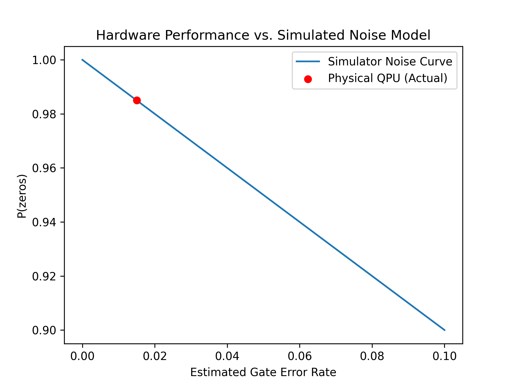
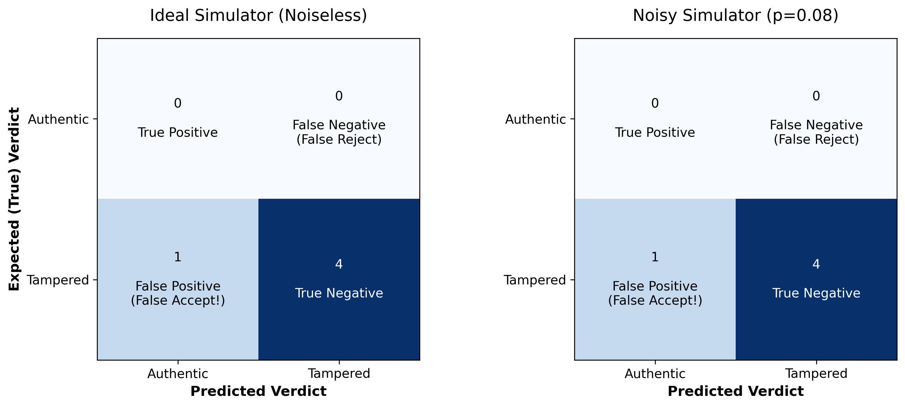

# Quantum Tamper-Evident QR Codes

[](https://github.com/r-makasana/quantum-tamper-evident-qr/actions/workflows/tests.yml)

A QR code system that uses true quantum randomness for nonce generation and the Deutsch-Jozsa algorithm for single-query tamper verification. Built with Qiskit and run on real IBM Quantum hardware.

> **Status:** Complete (v1.0). Generates and verifies tamper-evident QRs from the command line, runs on real IBM Quantum hardware, and is validated on a labeled corpus, a 1,000-sample blind holdout, and a simulator-vs-hardware comparison.


## Motivation

Standard QR codes are vulnerable to physical swap attacks (common in payment fraud) and digital tampering. This project explores whether quantum primitives can strengthen QR integrity:

- **True randomness** — Nonces come from quantum measurements (Hadamard + measure), not pseudo-random functions, so they cannot be reproduced from a seed.
- **Single-query verification** — A Deutsch-Jozsa oracle lets a verifier detect tampering in one quantum query.

This is primarily a learning and engineering exploration. A classical HMAC achieves tamper detection with less complexity; the value here is implementing real quantum algorithms end-to-end and quantifying how reliably they run on actual quantum hardware.

## How it works

1. **Generate** — a quantum random number generator produces a 128-bit nonce; an HMAC tag binds the data and nonce under a secret key; everything is packed (JSON → base64) into the QR image.
2. **Verify** — the verifier recomputes the expected tag, XORs it with the QR's tag to get a difference string `s`, and turns `s` into a Deutsch-Jozsa oracle.
3. **Decide** — running Deutsch-Jozsa recovers `s` in a single quantum query: all zeros → authentic, anything else → tampered (and the non-zero bits show exactly where the tags disagree).

On a noiseless simulator this is exact by construction; on real hardware the recovery degrades measurably with noise (see Results).

## Design

The full payload schema, threat model, generate/verify flows, limitations, and post-build findings are documented in [`DESIGN.md`](DESIGN.md). In short:

- QR payload is a base64-encoded JSON object: `{version, data, nonce, tag}`
- `nonce` is 128 bits from the quantum RNG
- `tag` is HMAC-SHA256(K, data || nonce) truncated to **n = 8 bits**
- Verification XORs observed vs expected tag → secret `s` → `oracle_from_secret(s)` → DJ
- Authentic → s = 0 → constant oracle → DJ measures zeros; tampered → s ≠ 0 → non-zero

## Results

**Simulator (full corpus):** 100% accuracy, 100% recall, zero false negatives. Expected on a noiseless backend — it validates the pipeline, not quantum advantage.

**Blind holdout (1,000 samples, simulator):** 99.6% accuracy. Every error was a false negative from an 8-bit tag collision — observed 0.81% among tampered samples, consistent with the predicted 2⁻⁸ ≈ 0.39% bound within sampling variance. This empirically confirms the documented tag-width limitation rather than hiding it.

**Real hardware (IBM `<backend name>` ← fill in, n = 4 authentic circuit, 1,024 shots):**
- Measured the all-zeros outcome 1,010 / 1,024 times → **P(zeros) = 98.6%** (vs 100% on the simulator)
- The remaining 1.4% scattered across `0001`, `0010`, `0100`, `1000` — real gate and readout noise
- P(zeros) stayed far above the 0.5 accept threshold, so the circuit **verified correctly as authentic** despite device noise

The small hardware gap is decoherence and gate error; it stays small here because the n = 4 circuit is shallow, so transpilation onto the device's native gates and connectivity adds little depth. Tampered detection was validated on the simulator and under a depolarizing noise model (below); the hardware demonstration covered the authentic case, as running the full tampered subset on hardware was limited by available QPU time.






## What's working

**Verifier** (`quantum_qr/verifier.py`)
- `verify(qr_path, n_bits=8, key=None, shots=1024, accept_threshold=0.5, confidence_floor=0.0, backend=None)` — returns a verdict dict
- Verdicts: `authentic`, `tampered`, `invalid` (undecodable QR — never crashes)
- **Injectable backend** via `run_counts()` — same code runs on noiseless sim, noisy sim, or real IBM hardware (Aer `.run()` vs `SamplerV2` primitive)
- `decide(counts, ...)` — pure decision function; returns verdict, `confidence`, `p_zeros`, `measured_secret`; noise-robust threshold + "inconclusive" floor
- Wrong key correctly flags an authentic QR as tampered

**Evaluation Harness** (`quantum_qr/evaluate.py`)
- `evaluate_corpus(...)` — accuracy, recall, precision, confusion matrix, per-tamper-type breakdown
- `plot_confusion_matrix(...)`; baseline in `data/eval_simulator.json`

**Generator** (`quantum_qr/generator.py`)
- `generate(data, output_path, n_bits=8, key=None, nonce=None)` — QRNG → HMAC tag → payload → QR image
- Fail-fast validation, capacity guard, full UTF-8 support, fresh quantum nonce per call

**Command-Line Interface** (`quantum_qr/cli.py`, `quantum_qr/__main__.py`)
- `python -m quantum_qr generate "<data>" -o out.png [-n 8] [--json]`
- `python -m quantum_qr verify <path> [--shots N] [--threshold T] [--bits 8] [--json]`
- Verdict-encoding exit codes (0 authentic / 3 tampered / 4 invalid / 1 error / 2 usage)

**Supporting modules**
- `payload.py` / `config.py` — HMAC tag, payload encode/decode, tags-to-secret, keyed via `QTQR_KEY`
- `dj.py` — DJ circuit + oracles; `oracle_from_secret(s)` recovers s in one query (Bernstein-Vazirani)
- `qrng.py` — 128-qubit Hadamard RNG, chi-square validated (p = 0.XX) ← *fill in*
- `qr_io.py` — lossless QR encode/decode via `qrcode` + `pyzbar`
- `fixtures.py` — labeled corpus + `manifest.json` answer key

## Project structure

```
quantum-tamper-evident-qr/
├── quantum_qr/
│   ├── __init__.py                   # Public API (generate, verify, decide, ...) + version
│   ├── qrng.py                       # Quantum random number generator
│   ├── dj.py                         # Deutsch-Jozsa circuit + oracles
│   ├── qr_io.py                      # QR encode/decode (qrcode + pyzbar)
│   ├── payload.py                    # HMAC tag, payload encode/decode, tags-to-secret
│   ├── config.py                     # Shared-key handling
│   ├── generator.py                  # End-to-end generate()
│   ├── verifier.py                   # DJ verify() + decide() + run_counts()
│   ├── evaluate.py                   # Corpus evaluation + confusion-matrix plot
│   ├── fixtures.py                   # Authentic + tampered fixture builder
│   ├── cli.py                        # argparse CLI (generate + verify)
│   └── __main__.py                   # enables `python -m quantum_qr`
├── notebooks/                        # day1 … day18 exploration notebooks
├── tests/                            # 43 simulator-based tests (run in CI)
├── data/
│   ├── gallery.png
│   ├── noise_sweep.png
│   ├── confusion_matrix.png
│   ├── hardware_run_n4.png           # physical QPU histogram (n=4 authentic)
│   ├── hardware_run_n4.json          # raw QPU counts
│   ├── eval_simulator.json
│   └── fixtures/                     # corpus + manifest.json
├── blind_test.py                     # 1,000-sample blind holdout test
├── blind_test_results.json           # blind-test summary (images gitignored)
├── .github/workflows/tests.yml       # CI: installs libzbar0, runs pytest on every push
├── DESIGN.md                         # Threat model, schema, flows, limitations, findings
├── LEARNINGS.md                      # Daily learning log
├── LICENSE
├── requirements.txt
└── README.md
```

## Installation

Requires Python 3.10 or newer.

```bash
git clone https://github.com/r-makasana/quantum-tamper-evident-qr.git
cd quantum-tamper-evident-qr
pip install -r requirements.txt
```

`pyzbar` bundles its zbar library on Windows. On Linux/macOS install the system library too (`sudo apt-get install libzbar0` or `brew install zbar`). Running on real hardware additionally requires a free IBM Quantum account and saved credentials via `qiskit-ibm-runtime`; the simulator path and the test suite need no credentials.

## Quick start

```python
from quantum_qr import generate, verify

generate("pay alice $10", "data/alice_payment.png")

result = verify("data/alice_payment.png")
print(result["verdict"])       # 'authentic'

print(verify("data/fixtures/fixture_01_data.png")["verdict"])  # 'tampered'
```

## Command-line usage

```bash
python -m quantum_qr generate "pay alice $10" -o data/alice.png
python -m quantum_qr verify data/alice.png          # exit code encodes the verdict
python -m quantum_qr verify data/alice.png --json
```

Exit codes: `0` authentic, `3` tampered, `4` invalid, `1` operational error, `2` usage error.

## Testing

```bash
pytest -v        # 43 tests, simulator-only, no IBM credentials required
python blind_test.py   # 1,000-sample blind holdout
```

CI runs the suite on every push (installing `libzbar0` for pyzbar first).

## Limitations (honest summary)

- **Keyed verification.** Only QRs issued with the shared `QTQR_KEY` can be verified; arbitrary third-party QRs return `invalid`. Key distribution is out of scope.
- **Equivalent to classical HMAC.** A classical tag comparison detects the same tampering with less complexity. The Deutsch-Jozsa step demonstrates a real quantum algorithm end-to-end; it is not a security improvement over HMAC.
- **8-bit tag.** A tampered QR has a 2⁻⁸ ≈ 0.39% chance of a tag collision (false negative), measured at 0.81% on the 1,000-sample blind test. A larger tag reduces this.
- **NISQ noise.** On real hardware the DJ readout degrades (98.6% on the n=4 authentic circuit vs 100% in simulation); the verifier mitigates this with a confidence threshold and an "inconclusive" verdict.
- **Verifies integrity, not intent.** A correctly-signed malicious message is "authentic" — the system proves a payload wasn't altered after issuing, not that its content is safe.

## References

- Deutsch, D. & Jozsa, R. (1992). Rapid solutions of problems by quantum computation. *Proc. R. Soc. Lond. A* 439, 553–558.
- Bernstein, E. & Vazirani, U. (1997). Quantum complexity theory. *SIAM J. Comput.* 26(5), 1411–1473.
- Nielsen, M. & Chuang, I. *Quantum Computation and Quantum Information.*
- [Qiskit Documentation](https://docs.quantum.ibm.com/)

## License

MIT — see [`LICENSE`](LICENSE).